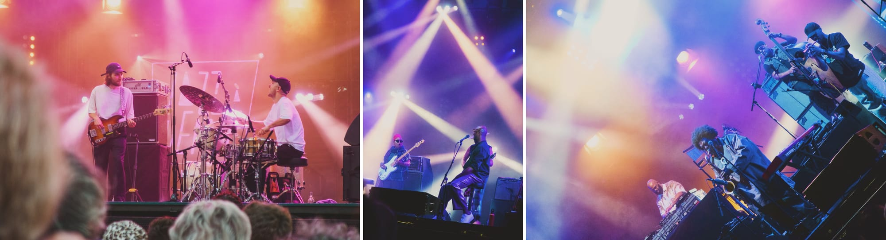
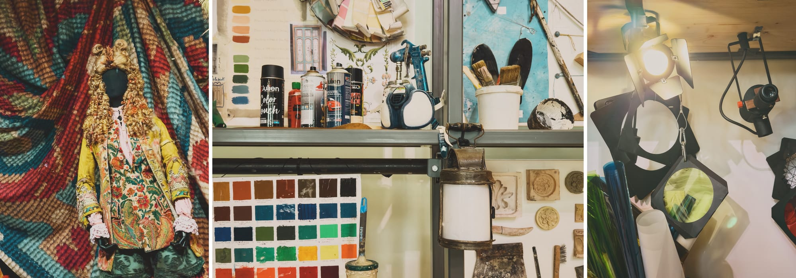

It’s official: we passed the 1.5 °C climate threshold. Here in Lyon, we’ve experienced entire weeks with temperatures 8 to 12 °C above the 1991–2020 climatological normal. This isn’t a typo, that’s 8 to 12 °C, not 0.8 to 1.2 °C. And there are still people believing that human-driven climate change is a hoax, driving their gas guzzlers to “travel” alone for no more than a few hundred metres and fighting even the most trivial measures aimed at reducing emissions and mitigating their consequences.

It’s hard not to feel more than a little bit frightened — and that’s even before considering that our brand of “ecologists” prefer to be on the far-left side of parliament rather than the right side of history, to elicit a reaction rather than spring into action, to launch themselves into incomprehensible ideological quarrels rather than come up with actual and actionable solutions. Everyone acts as if we have all the time in the world, but the world is quite literally burning up.

## Albums

***Fiend* by Enemy.** Recorded over a two-day residency at Bird’s Eye in Basel, *Fiend* is Enemy’s tightest release yet. I have no idea how Kit Downes can play the piano with such lightness while Petter Eldh weaves intricate bass lines and James Maddren layers more rhythms than he has limbs. It sounds like a long – but never tiring – jam session. Highly recommended.

***Sonor* by Enji.** Where has Mongolian jazz been all my life? You might understand her when she sings in English and German, but Enji is most captivating when she channels the traditional art of the Mongolian long song, which extends each syllable to evoke the vastness of the country’s plains. Her music is as forward-looking as her singing is deeply rooted, and they blend together in a way that’s deeply hypnotic. Let’s hope this is not the last time i listen to Mongolian jazz.

***Nidi di Note* by Paolo Fresu.** If i understand correctly, *Nidi di Note* is a book that tells the story of Cirino and Coretta, *“two brothers who went in search of the Sun and the Moon singing.”* *“It can be read and listened to as a musical education path for children”* and contains a CD featuring the eleven rhymes from the book recited by Bruno Tognolini and ten original songs played by Paolo Fresu. I don’t think it was made for that, but i’ve enjoyed falling asleep to this story that i can sort of understand.

***Questions (Volume One)* by Mark Guiliana.** I’m a simple man: i see a new Mark Guiliana record, i buy a new Mark Guiliana record. *Questions (Volume One)* is as minimalist as *MARK* was maximalist, demonstrating that Guiliana doesn’t need dozens of tracks to show his compositional skill. This is the meditative and melancholic part of the Guilianaverse, and i’m here for it.

***Une question d’enfant* by Emma Giulia.** I’m weirdly fussy about French jazz, but i have no reservations with this one. Giulia cites Stevie Ray Vaughan, Pat Metheny, Charles Mingus, St Vincent and even Rita Mitsouko as inspirations. If *Une question d’enfant* is anything to go by, it’s not a bad cocktail of influences. The first (“Resilience”) and last (“Praise of Risk”) tracks have been released as singles, but i’ve been particularly taken by the third one, “La vision du Simon”. I hope to catch Giulia on tour soon.

## Apps

[**Plexamp**](https://www.plex.tv/plexamp/)**.** I finally took the time to consolidate my digital music collection, which was scattered between my Qobuz and Bandcamp accounts, two partially overlapping libraries on my computer and old CD rips on an external hard drive. My 5,243 (and counting) albums are now stored on [a Synology DS925+ network attached storage](https://amzn.to/3IhNElJ) and served by [Plex](https://www.plex.tv/) with the Plexamp app. I haven’t used all of Plexamp’s functions yet, but i’ve already rediscovered forgotten favourites thanks to its “On This Day” feature. I love having my own personal streaming service.

[**Bliss**](https://www.blisshq.com/)**.** Bliss has been instrumental in organizing my music files, fetching good-quality covers and fixing metadata issues. Even though it can be sluggish (it’s a Java app after all) and has an idiosyncratic interface, it’s fairly easy to use. Most importantly, it can assess files in the background. This means i can just throw new albums into any folder, and Bliss will tidy up and categorize everything for me. It’s like a server-based iTunes!

**Liquid Glass.** I don’t love it, but i don’t hate it. It reminds me of the early versions of Aqua and iOS 7, but it’s more refined than the former and more enjoyable than the latter. A new generation of designers is speedrunning what we’ve been going through in the 2000s and the 2010s. It puts the fun in “functional”, and Apple needs more of that, as they take themselves far too much seriously. There’s still a lot of work to be done on accessibility and consistency, but i like where this is heading, despite being a death knell for third-party design.

## Books

[***Careless People***](https://bookshop.org/a/110644/9781250391230) **by Sarah Wynn-Williams.** At the end of *The Social Network*, Rashida Jones’s character says that *“when there’s emotional testimony”*, she assumes *“that 85% of it is exaggeration.”* The rest, of course, is *“perjury — creation myths need a devil”*. From the very first pages of her book, where Mark Zuckerberg slaloms between galloping horses at a state dinner and flees through archaeological remains to the Panamanian jungle, it is clear that it applies to Wynn-Williams’ recollection too. It doesn’t mean you shouldn’t trust her when she tells you that these people are the most spoiled, unscrupulous, narcissistic, entitled, dissolute, sleazy and just plain weird little brats you could find on Earth. You just need to use their products to feel their crass cupidity, their hatred for the slightest trace of decency and their absolute lack of morality. Even a work of fiction can make a valid point.

[***Mood Machine***](https://bookshop.org/a/110644/9781668083505) **by Liz Pelly.** This one was a bit of a slog — it felt like a collection of repetitive essays that were only loosely connected by the most naive critique of capitalism. That being said, *Mood Machine* is one of the best researched books i’ve read about Spotify, explaining the intricacies of the streaming industry in a simple and straightforward language. If you can get past the *“wake up, sheeple!”* vibe, you’ll learn a lot about how Spotify precipitated the decline of the music industry by pretending to save it.

[***Bibliophobia***](https://bookshop.org/a/110644/9780593594728) **by Sarah Chihaya.** Can books ruin your life? Maybe, at least if you stake your whole identity in your ability to write a PhD thesis about them, like Chihaya did. The middle part feels like a study in depression, and judging by her tendency to invalidate her own emotions, i’m not sure the author has gone through to the other side. The opening and closing chapters, though, make for a visceral read. I wouldn’t be surprised if *Bibliophobia* ended up becoming a cult classic.

[***This is a Love Story***](https://bookshop.org/a/110644/9780593851265) **by Jessica Soffer.** Jane (a world-renowned artist) and Abe (a world-renowned author) have been married for more years than i’ve been alive. Their estranged son Max (a world-renowned art dealer) has been wasting his life away in the big city. Central Park (a world-renowned park) is a place where a lot of stuff happens. Jane is dying from yet another bout of cancer. Jessica Soffer (a not-yet world-renowned author) has chosen to write most of this heartbreaking tale in the second person. This is a love story and this was wonderful.

## Concerts

**Cuarteto Casals at Auditorium de Lyon.** Juan Crisóstomo Jacobo Antonio de Arriaga y Balzola might be the “Basque Mozart”, but i don’t think a lot of people outside Spain have heard about him. The Cuarteto Casals’ interpretation of his third string quartet was holographic — you could actually picture the birds flying away from the approaching thunder! After years of seeing her on the screen, i was happy to finally see Ana Vidović in the flesh. She has an incredible dynamic range, and i’m absolutely humbled by her ability to play the guitar so loosely and so precisely at the same time. Her performance on Boccherini’s fourth quintet was a masterclass.

**‌Anouar Brahem Quartet at Auditorium de Lyon.** You couldn’t tell if Anouar Brahem was a bad musician: with Django Bates on the drums, Anja Lechner on the cello and Dave Holland on the bass, he has one of the tightest groups imaginable. But Anouar Brahem is a fantastic musician: i can’t think of another player that can bring the most ancient sonorities of Islamic music and the most modern patterns of jazz out of an [oud](https://en.wikipedia.org/wiki/Oud). I can’t wait for his next album.

**Arooj Aftab, Rabih Abou-Khalil and Dhafer Youssef at** [**Jazz à Vienne**](https://www.jazzavienne.com/en)**.** I’ll never understand why some older North Africans feel the need to joke at their own expense. Dhafer Youssef’s behaviour was particularly egregious, as he perpetuated overtly racist stereotypes between songs, rendering his pro-Gaza interventions meaningless. Rabih Abou-Khalil was funnier in a “sorry about my weird uncle” kind of way — it doesn’t hurt that his music was less repetitive and more melodically accomplished than Youssef’s. In the end, Arooj Aftab was the highlight of the evening, blending jazzy rock and Hindustani electronica in a mesmerizing performance.

**Donny McCaslin & Ishkero, Meshell Ndegeocello and Kamasi Washington at Jazz à Vienne.** No offence to Donny McCaslin, who might be my favourite saxophonist alive, but i was there for Ishkero. Boy did they deliver! Their (far too short) set was a headbanger. I’m incredibly happy to have seen them become a confident band with incredible musical chops. I might have a crush on their keyboardist Arnaud Forestier — i don’t often get starry-eyed at a signing, let me tell you that my wife was jealous, but this guy is just as sweet as he’s groovy. *‌No More Water* was one of my favourites from 2024 and there was more than a little water in my eyes when Meshell Ndegeocello recited James Baldwin’s most powerful verses. This night was already unforgettable, but then Kamasi Washington took the stage and showed us the true power of music. What a properly awe-inspiring player! I was emotionally wrecked in the end. It was heartwarming to see his father supporting him on the saxophone while his daughter danced backstage and his wife sang a new song.

## Links

Here are some articles for your consideration:

- [“How to like everything more”](https://sashachapin.substack.com/p/how-to-like-everything-more) by Sasha Chaplin
- [“So is Everybody Giving Up On, Like… Doing Things?”](https://freddiedeboer.substack.com/p/so-is-everybody-giving-up-on-like) by Freddie deBoer
- [“Nobody Has A Personality Anymore”](https://www.freyaindia.co.uk/p/nobody-has-a-personality-anymore) by Freya India
- [“Overtourism in Japan, and How it Hurts Small Businesses”](https://craigmod.com/ridgeline/210/) by Craig Mod
- [“The Media’s Pivot to AI Is Not Real and Not Going to Work”](https://www.404media.co/the-medias-pivot-to-ai-is-not-real-and-not-going-to-work/) by Jason Koebler

## Movies

***Conclave* by Edward Berger.** Would i have watched *Conclave* if it hadn’t been available on Netflix at the time of Pope Francis’s death? No — it’s pure Oscar bait with a preposterous (but eminently edgy) ending that blatantly disregards the history of the church and the practice of the Catholic faith. Am i mad i watched it? Also no — it’s a gorgeous, gorgeous, piece of cinema. Monsieur Gustave H is *almost* believable as the dean of the College of Cardinals.

***Fountain of Youth* by Guy Ritchie.** I like that Apple TV+ has become a haven for so-bad-they’re-good movies. After *Argylle* and *The Gorge*, *Fountain of Youth* is another triumph of sheer mediocrity. Turn off your brain, turn up the volume, get some snacks and enjoy this rip-off of a facsimile of a pastiche of an ersatz *Indiana Jones* movie.

***Flow* by Gints Zilbalodis.** I’m not crying, you are.

***F1* by Joseph Kosinski.** It might be an Apple Studios film, but it was definitely not an Apple experience. The cinema was packed with people from all genres, colours and ages, many of whom had taken up the offer for 50% off a bucket of popcorn… if they paid with Apple Pay. It was a sweaty, smelly and raucous affair. In other words, it was the perfect ambiance for this immensely enjoyable blockbuster. You’ve seen this story unfold a million times, and if you’re a fan of F1, you’ll wince every time Kosinski rewrites the rules of the sport. But it’s visually stunning, primal and [seriously unserious](/seriously-unserious/). I enjoyed every second of it.

***Wicked* by Jon M. Chu.** Without the sheer talent of the amazing Cynthia Erivo, *Wicked* would be an incredibly overdrawn, humourless, shallow and ugly film. Even with it, *Wicked* is a bloated mess that completely misses the point of the play, which itself was a poor adaptation of [a brilliant book](https://bookshop.org/a/110644/9780061792946).

## Travel

**Moulins-sur-Allier.** Moulins isn’t the most walkable city in the world, despite the scenic walkways along the Allier River. [The National Centre for Theatrical Costume and Design](https://cncs.fr/en/homepage/) displays costumes just as the Louvre displays paintings, without explaining why – and most importantly how – they were made. It’s beautiful, but in a superficial and meaningless way. The adjacent [“La Scène”](https://cncs.fr/en/a-visiter/opening-of-la-scene-april-8/) building is much more interesting: it explains how theatre is made by dropping you right in the middle of one. How fun!

## TV shows

***The Residence* by Paul Williams Davis.** I’m not mad *The Residence* was cancelled… because i loved it as a standalone murder mystery. Uzo Aduba’s performance as the quirky detective and avid birder Cordelia Cupp was delightful, and the rest of the cast was top-notch. As the White House plays the biggest role, it was important to explain its operation and layout. Paul Williams Davis successfully did so by leaning on [Kate Andersen Brower’s book about the Residence](https://bookshop.org/a/110644/9780062305206).

***Chef’s Table: Legends* by David Gelb.** For the past few seasons, *Chef’s Table* has consisted of lengthy episodes filled with masturbatory shots and vacuous narration. *Legends* shakes things up with vacuous shots and masturbatory narration.

***Ghosts* by Joe Port and Joe Wiseman.** After an accident that leaves her clinically dead for three minutes, Sam gains the ability to see and hear ghosts. This isn’t the most original setup, especially because it’s an adaptation of the British show of the same name, but it’s been thouroughly enjoyable to watch. The ensemble cast is strong, the writing avoids the usual clichés about ghosts and some episodes are seriously thought-provoking.

***Murderbot* by Paul and Chris Weitz.** A refurbished robot that has hacked its governing module has been commissioned as the security unit of a band of naive scientists. What could possibly go wrong? Everything, because it’s not easy to make great TV when your main character is an emotionless bot that hates eye contact. Fortunately, Paul and Chris Weitz’s writing is witty and Alexander Skarsgård’s acting is top-notch. I can’t wait for the second season, even though it will feature an entirely new cast of humans.
